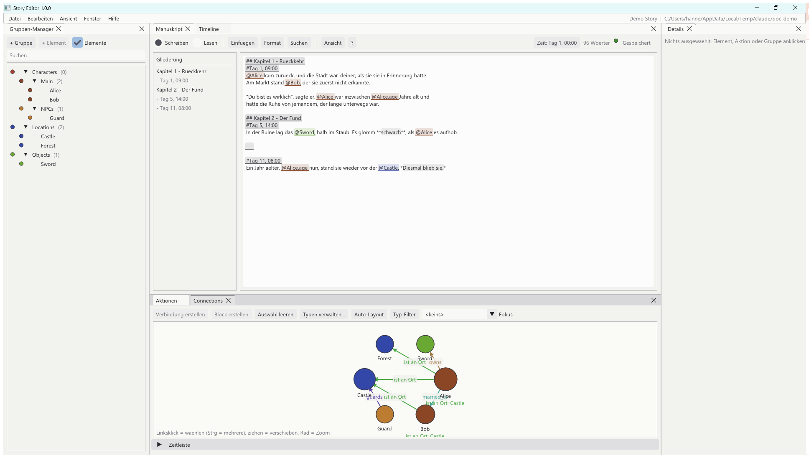

<div align="center">

# 📖 Story Editor

**Writing software for big stories.**
You write – the program remembers who was where and when, how old somebody currently is
and what has already happened.

[<kbd> &nbsp; 🚀 &nbsp; Get started &nbsp; </kbd>](docs/en/01-getting-started.md)
[<kbd> &nbsp; ✍️ &nbsp; Learn to write &nbsp; </kbd>](docs/en/03-manuscript.md)
[<kbd> &nbsp; 🗺️ &nbsp; All chapters &nbsp; </kbd>](#-handbook)
[<kbd> &nbsp; 🇩🇪 &nbsp; Deutsch &nbsp; </kbd>](README.md)

<br>



</div>

---

## 🤔 What is this for?

In a long story you eventually lose track:

> *Was Alice actually 28 already in chapter 12?
> Did Bob even know about the sword at that point?
> And where was the dragon when the castle was attacked?*

Story Editor answers questions like these **while you write**. You type your text
normally; wherever a character appears, you insert them with a click. From that the
program builds a timeline, a character database and a relationship net in the
background.

```
             You write                          The program builds
   ┌────────────────────────────────┐        ┌──────────────────────────────┐
   │  "@Alice was @Alice.age        │        │  📅 timeline                 │
   │   years old by then."          │  ───▶  │  👥 characters with values   │
   │                                │        │  🔗 relationships            │
   │  #Day 11, 08:00                │        │  📋 list of events           │
   └────────────────────────────────┘        └──────────────────────────────┘
              one text                         everything else follows
```

Everything is stored as **readable Markdown files in an Obsidian vault** – no secret
file format, no cloud account, and versionable with Git.

---

## ⚡ Up and running in 5 minutes

```sh
# 1. Build (once; needs Visual Studio 2022 + CMake)
cmake -S . -B build -G "Visual Studio 17 2022" -A x64
cmake --build build --config Release

# 2. Create a sample project to play with
./build/bin/StoryEditor.exe --demo C:/Temp/MyDemo

# 3. Start and open that folder (File → Open project…)
./build/bin/StoryEditor.exe
```

Step by step, with every step explained, in
**[Chapter 1 · Getting started](docs/en/01-getting-started.md)**.

---

## 📚 Handbook

Every chapter is its own page. Start at the top left and work your way through –
or jump straight to what you need.

### To begin with

| | |
|:--|:--|
| **[📦 1 · Getting started](docs/en/01-getting-started.md)**<br>Build, start, create your first project. What is a "vault"? | **[🪟 2 · The program window](docs/en/02-overview.md)**<br>What each window does, how to move them, how to bring a closed one back. |
| **[✍️ 3 · Writing](docs/en/03-manuscript.md)**<br>The heart of it – like Word: ribbon, pages, fonts, colours, lists, comments, inserting characters, find & replace. | **[👥 4 · Characters, places, things](docs/en/04-groups.md)**<br>Create groups and elements, templates and field types. |

### The time system

| | |
|:--|:--|
| **[⏳ 5 · How time works](docs/en/05-time.md)**<br>The single most important idea in the program. Do read this one. | **[⚡ 6 · Events & value changes](docs/en/06-actions.md)**<br>Create actions, make ages count up, change states. |
| **[📅 7 · The timeline](docs/en/07-timeline.md)**<br>Everything on one time axis: tracks, zoom, dragging, filters. | **[🔗 8 · Relationships](docs/en/08-connections.md)**<br>Who is married to whom, who is where – with templates you define. |

### Reading, exporting, configuring

| | |
|:--|:--|
| **[📜 9 · Chronicle & detail panel](docs/en/09-chronicle.md)**<br>Read the story as a narrative; see everything about a single element. | **[💾 10 · Files, images & export](docs/en/10-files.md)**<br>Add images, produce a Word file, read on in Obsidian. |
| **[⚙️ 11 · Settings & controls](docs/en/11-settings.md)**<br>Theme, language, your own lists, keyboard shortcuts, saving & undo. | **[🔧 12 · Under the hood](docs/en/12-internals.md)**<br>For the curious and for developers: file format, source code, self test, limits. |

---

## 🧭 The four building blocks

If you take only one thing away from this handbook, take these four terms –
everything else builds on them:

| Block | What it is | Example | Chapter |
|:--|:--|:--|:--|
| 🧩 **Element** | A thing in your world. Has fields with values. | Alice, the castle, the sword | [4](docs/en/04-groups.md) |
| ⏳ **Point in time** | Where in the story you currently are. Stays put until you move it. | "Day 11, 08:00" | [5](docs/en/05-time.md) |
| ⚡ **Action** | Something happens. May change values of elements. | "Alice's birthday" changes `age: 27 → 28` | [6](docs/en/06-actions.md) |
| 🔗 **Connection** | A state that holds for a while. | "Alice is at place: Castle" from day 1 | [8](docs/en/08-connections.md) |

```
                        ┌──────────────┐
                        │   ELEMENT    │   Alice
                        │  name, age…  │   age = 27
                        └──────┬───────┘
                               │
            ┌──────────────────┼──────────────────┐
            │                  │                  │
     ┌──────▼──────┐    ┌──────▼──────┐    ┌──────▼───────┐
     │   ACTION    │    │ CONNECTION  │    │  MANUSCRIPT  │
     │  Birthday   │    │ at place:   │    │  "@Alice is  │
     │  Day 11     │    │ Castle      │    │  @Alice.age" │
     │ age 27 → 28 │    │ from day 1  │    │              │
     └─────────────┘    └─────────────┘    └──────┬───────┘
            │                  │                  │
            └──────────────────┴──────────────────┘
                               │
                    from day 11 on, age = 28
                    — everywhere at the same time
```

---

## 💡 What makes it different

| | |
|:--|:--|
| **No built-in vocabulary** | The program knows no "person" or "place". You decide which groups exist and which fields they have. → [Chapter 4](docs/en/04-groups.md) |
| **Values know about time** | `@Alice.age` means 27 in chapter 1 and 28 in chapter 9 – in the same text, without you editing anything. → [Chapter 5](docs/en/05-time.md) |
| **Structure falls out of writing** | Write a paragraph, turn it into an event with one click. The timeline fills up while you write, not through forms. → [Chapter 6](docs/en/06-actions.md) |
| **Your files stay yours** | Everything lives as Markdown + JSON in a folder. Read it in Obsidian, version it with Git. → [Chapter 12](docs/en/12-internals.md) |
| **Bilingual** | The whole interface exists in German and English, switchable while running. → [Chapter 11](docs/en/11-settings.md) |

---

## 🛠️ Technical summary

| | |
|:--|:--|
| **Language** | C++17 |
| **UI** | [Dear ImGui](https://github.com/ocornut/imgui) (immediate mode GUI) |
| **Platform** | Windows, Win32 + DirectX 11 |
| **Storage** | Obsidian vault: Markdown files + JSON |
| **Dependencies** | ImGui, nlohmann/json, stb_image – fetched automatically by CMake |
| **Tests** | `StoryEditor.exe --selftest` – 122 checks, exit code 0 = all good |

The full requirements specification this was built from is in [`claude.md`](claude.md)
(German).

---

<div align="center">

[<kbd> &nbsp; 🚀 &nbsp; On to chapter 1 · Getting started &nbsp; </kbd>](docs/en/01-getting-started.md)

</div>
