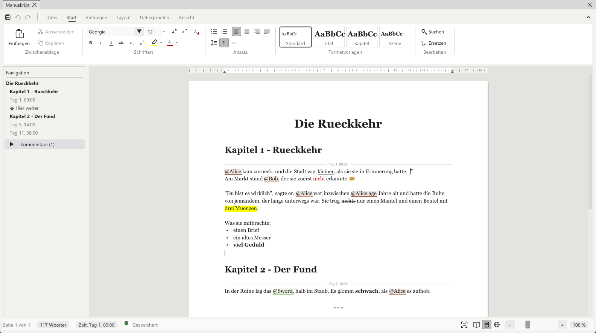
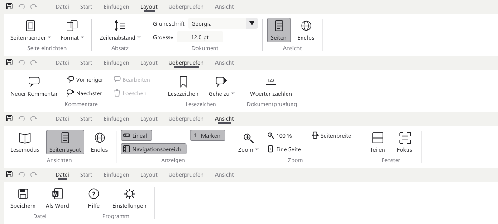

[<kbd> &nbsp; ← Übersicht &nbsp; </kbd>](../../README.md)
[<kbd> &nbsp; ← Zurück: 2 · Das Programmfenster &nbsp; </kbd>](02-ueberblick.md)
[<kbd> &nbsp; Weiter: 4 · Figuren, Orte, Dinge → &nbsp; </kbd>](04-gruppen.md)

---

# ✍️ Kapitel 3 · Schreiben

> **Das wichtigste Kapitel.** Hier passiert die eigentliche Arbeit. Das Manuskript sieht
> aus und bedient sich wie Word: ein Blatt Papier, darüber das Menüband, unten die
> Statusleiste. Am Ende kannst du Text schreiben und formatieren, Figuren und Werte
> einsetzen, gliedern, Notizen anhängen und suchen – **ohne ein einziges Sonderzeichen
> auswendig zu lernen.**

---

## 3.1 Erstmal: einfach schreiben



Klick auf das Blatt und tipp los. Was du siehst, ist das, was du bekommst:
Überschriften sind groß, Fettes ist fett, Farben sind farbig.

```
 Tag 1. Alice kam zurück, und die Stadt war kleiner, als sie sie
 in Erinnerung hatte. Am Markt stand Bob, der sie zuerst nicht
 erkannte.
```

| Taste | Wirkung |
|:--|:--|
| <kbd>Enter</kbd> | Neuer Absatz (in einer Liste: neuer Punkt, auf einem leeren Punkt: Liste beenden) |
| <kbd>←</kbd> <kbd>→</kbd> <kbd>↑</kbd> <kbd>↓</kbd>, <kbd>Pos1</kbd> <kbd>Ende</kbd>, <kbd>Bild↑</kbd> <kbd>Bild↓</kbd> | Cursor bewegen – mit <kbd>Umschalt</kbd> markieren, mit <kbd>Strg</kbd> wortweise |
| Doppelklick / Dreifachklick | Wort / ganzen Absatz markieren |
| <kbd>Strg</kbd>+<kbd>A</kbd> | Alles markieren |
| <kbd>Strg</kbd>+<kbd>X</kbd> / <kbd>C</kbd> / <kbd>V</kbd> | Ausschneiden, Kopieren, Einfügen – innerhalb des Manuskripts bleibt die Formatierung erhalten |
| <kbd>Strg</kbd>+<kbd>Z</kbd> / <kbd>Y</kbd> | Rückgängig / Wiederholen |
| <kbd>Strg</kbd>+Mausrad | Zoomen |
| Rechtsklick | Kontextmenü mit den häufigsten Befehlen |

Das funktioniert schon. Aber das Programm weiß dabei nichts über Alice und Bob –
für es sind das nur Buchstaben. Abschnitt 3.4 ändert das.

---

## 3.2 Das Menüband



Oben links stehen **Speichern**, **Rückgängig** und **Wiederholen**, daneben die
Registerkarten. Das Pfeilchen ganz rechts klappt das Band ein und aus.

| Registerkarte | Was darin steht |
|:--|:--|
| **Datei** | Speichern, als Word speichern, Hilfe, Einstellungen |
| **Start** | Zwischenablage, Schriftart, Absatz, Formatvorlagen, Suchen |
| **Einfügen** | Figuren, Werte, Aktionen, Zeitpunkte, Szenenwechsel, Lesezeichen, Kommentare |
| **Layout** | Seitenränder, Papierformat, Zeilenabstand, Grundschrift, Seiten oder Endlos |
| **Überprüfen** | Kommentare anlegen und durchgehen, Lesezeichen, Wörter zählen |
| **Ansicht** | Lesemodus, Lineal, Navigationsbereich, Zoom, geteilte Ansicht, Fokus |

> 💡 Das Programm merkt sich, welche Registerkarte zuletzt offen war.

---

## 3.3 Formatieren


Wie in Word: **erst markieren, dann klicken.** Ohne Markierung gilt das Format für das,
was du als Nächstes tippst.

### Schriftart

| Knopf | Wirkung |
|:--|:--|
| **Georgia ▾** | Schriftart der Markierung |
| **12 ▾** | Schriftgrad in Punkt – eintippen oder aus der Liste wählen |
| **A˄ A˅** | Schrift eine Stufe größer / kleiner |
| **A mit Radierer** | Formatierung entfernen |
| **F K U ab** | Fett, kursiv, unterstrichen, durchgestrichen |
| **x₂ x²** | Tief- und hochgestellt |
| **Stift ▾** | Texthervorhebung (Leuchtmarker-Farbe) |
| **A ▾** | Schriftfarbe – aus der Palette oder unter „Weitere Farben…" frei gewählt |

Die Knöpfe zeigen an, was an der Cursorstelle gilt – steht der Cursor in fettem Text,
ist **F** hervorgehoben.

### Absatz

| Knopf | Wirkung |
|:--|:--|
| **•≡** / **1≡** | Aufzählung / Nummerierung – die Nummern zählen von selbst weiter |
| **Ausrichtung** | Linksbündig, zentriert, rechtsbündig, Blocksatz |
| **Zeilenabstand ▾** | 1,0 bis 3,0 – gilt für das ganze Manuskript |
| **¶** | Zeit‑ und Aktionsmarken auch im Lesemodus anzeigen |
| **✱✱✱** | Szenenwechsel einfügen |

### Formatvorlagen

| Vorlage | Wofür | In Word |
|:--|:--|:--|
| **Standard** | Fließtext | Standard |
| **Titel** | Titel des Werks | Titel |
| **Kapitel** | Kapitelüberschrift – erscheint im Navigationsbereich | Überschrift 1 |
| **Szene** | Szenenüberschrift – eingerückt im Navigationsbereich | Überschrift 2 |

Ein Klick formatiert den ganzen Absatz, in dem der Cursor steht.

### Tastenkürzel

| Kürzel | Wirkung |
|:--|:--|
| <kbd>Strg</kbd>+<kbd>B</kbd> / <kbd>I</kbd> / <kbd>U</kbd> | Fett / kursiv / unterstrichen |
| <kbd>Strg</kbd>+<kbd>+</kbd> / <kbd>Strg</kbd>+<kbd>#</kbd> | Hochgestellt / tiefgestellt |
| <kbd>Strg</kbd>+<kbd>Umschalt</kbd>+<kbd>></kbd> / <kbd>Strg</kbd>+<kbd><</kbd> | Schrift größer / kleiner |
| <kbd>Strg</kbd>+<kbd>Leertaste</kbd> | Formatierung entfernen |
| <kbd>Strg</kbd>+<kbd>L</kbd> / <kbd>E</kbd> / <kbd>R</kbd> / <kbd>J</kbd> | Links / zentriert / rechts / Blocksatz |

> 🛟 **Kein Chaos möglich:** Das Programm schreibt die Formatierung selbst in die Datei
> und hält sie dabei immer vollständig – eine halbe Hervorhebung, die den Rest des
> Buches fett färbt, kann nicht entstehen.

---

## 3.4 Eine Figur einsetzen

Statt „Alice" einfach hinzutippen, setzt du eine **Marke**. Dann weiß das Programm,
dass hier *die* Alice gemeint ist.


### So geht's

1. Cursor an die Stelle setzen, wo der Name hin soll
2. **Einfügen → Element ▾**
3. Oben ins Suchfeld tippen, wenn die Liste lang ist
4. Auf den Namen klicken

Im Text steht danach `@Alice` – mit einem farbigen Untergrund in der Farbe ihrer Gruppe.
Folgt direkt ein Wort, setzt das Programm ein Leerzeichen dazwischen.

### Schneller: einfach `@` tippen

Wenn du im Schreibfluss bist, tipp mitten im Satz einfach `@` und schreib den Namen
weiter. Unter dem Cursor klappt eine Vorschlagsliste auf:

| Taste | Wirkung |
|:--|:--|
| <kbd>↑</kbd> <kbd>↓</kbd> | Vorschlag auswählen |
| <kbd>Enter</kbd> | Übernehmen (wenn etwas ausgewählt ist) |
| <kbd>Tab</kbd> | Übernehmen, immer |
| <kbd>Esc</kbd> | Liste wegklicken |

> 💡 <kbd>Enter</kbd> macht weiterhin einen Absatz, solange du nichts ausgewählt hast.
> Nur hineinklicken öffnet die Liste nicht – sie erscheint erst, wenn du tippst.

### Was du davon hast

| | |
|:--|:--|
| 🎨 **Sichtbar** | Die Marke hat den Untergrund der Gruppenfarbe |
| 🔗 **Klickbar** | <kbd>Strg</kbd>+Klick öffnet die Figur im Details‑Fenster, beim Überfahren steht der Pfad da |
| 🔴 **Tippfehlersicher** | Ein Name, den es nicht gibt, wird **rot** – du siehst den Fehler sofort |
| 📊 **Auswertbar** | Die Timeline weiß jetzt, dass Alice in dieser Szene vorkommt |

---

## 3.5 Einen Wert einsetzen

Das ist der Trick, für den es das Programm gibt.

Statt „Alice war 27 Jahre alt" schreibst du **„Alice war `@Alice.age` Jahre alt"**.
Im fertigen Text steht dann automatisch die Zahl, die *an dieser Stelle der Geschichte*
gilt – in Kapitel 1 die 27, in Kapitel 9 die 28.

### So geht's

1. **Einfügen → Wert ▾**
2. Auf die Figur zeigen – ein Untermenü klappt auf mit **allen ihren Feldern**
3. Neben jedem Feld steht gleich der Wert, der hier gerade gilt
4. Feld anklicken

```
  Einfügen ▸ Wert ▸ ● Alice ▸ ┌───────────────────────────┐
                              │ name       Alice          │
                              │ age        27             │
                              │ status     Alive          │
                              │ backstory  (leer)         │
                              └───────────────────────────┘
```

Im Text steht danach `@Alice.age`; beim Überfahren siehst du den aktuellen Wert. Wenn
das Feld leer ist oder nicht existiert, setzt das Programm ersatzweise den Namen ein –
es entsteht also nie eine Lücke im Text.

> 📖 Warum derselbe Ausdruck zwei verschiedene Zahlen ergibt, steht in
> **[Kapitel 5 · Wie die Zeit funktioniert](05-zeit.md)**.

---

## 3.6 Lesezeichen und Kommentare

Zwei Werkzeuge nur für dich – im fertigen Text und in der Word‑Datei stehen sie nie.

| | So geht's | Im Text |
|:--|:--|:--|
| 🚩 **Lesezeichen** | **Einfügen → Lesezeichen** (oder **Überprüfen**), Namen eingeben | Fähnchen; der Name steht im Navigationsbereich, **Überprüfen → Gehe zu** springt hin |
| 💬 **Kommentar** | **Einfügen → Kommentar**, **Überprüfen → Neuer Kommentar** oder Rechtsklick | Sprechblase; Überfahren zeigt den Text, Klick bearbeitet oder löscht ihn |

Mit **Überprüfen → Vorheriger / Nächster** gehst du alle Kommentare der Reihe nach durch.
Ist einer markiert, lässt er sich dort auch bearbeiten und löschen.

---

## 3.7 Der Navigationsbereich

Links steht die Gliederung deines Textes: Titel und Kapitel fett, Szenen eingerückt,
dazu jeder Zeitpunkt und jedes Lesezeichen. Ein Klick springt an die Stelle.
Darunter klappt die Liste aller **Kommentare** auf.

Aus- und einblenden kannst du ihn über **Ansicht → Navigationsbereich**.

---

## 3.8 Suchen und Ersetzen


**Start → Suchen** (<kbd>Strg</kbd>+<kbd>F</kbd>) bzw. **Ersetzen**
(<kbd>Strg</kbd>+<kbd>H</kbd>) blendet eine Leiste über der Seite ein.

| | |
|:--|:--|
| **Beim Tippen** | *Alle* Treffer werden gelb hinterlegt und gezählt („1 / 5") |
| <kbd>Enter</kbd> / <kbd>F3</kbd> | Zum nächsten Treffer springen |
| <kbd>Umschalt</kbd>+<kbd>F3</kbd> | Zum vorherigen |
| ▲ ▼ | Dasselbe mit der Maus |
| **Gross/klein** | Groß‑ und Kleinschreibung beachten |
| **Ersetzen** | Nur den angesteuerten Treffer |
| **Alle ersetzen** | Alle auf einmal – lässt sich mit <kbd>Strg</kbd>+<kbd>Z</kbd> rückgängig machen |
| <kbd>Esc</kbd> | Leiste schließen |

---

## 3.9 Seite, Zoom und Ansicht

| Wo | Was |
|:--|:--|
| **Layout → Seitenränder / Format** | Rand (schmal bis breit) und Papier (A4, A5, Letter) |
| **Layout → Zeilenabstand, Grundschrift, Größe** | Gilt für das ganze Manuskript – auch in der Word‑Datei |
| **Layout / Ansicht → Seiten oder Endlos** | Einzelne Blätter wie auf Papier oder ein durchgehendes Blatt über die ganze Breite |
| **Ansicht → Lineal** | Zentimeter‑Lineal mit den Rändern über der Seite |
| **Ansicht → Zoom** | 50 % bis 300 %, „Eine Seite", „Seitenbreite" – oder <kbd>Strg</kbd>+Mausrad |
| **Ansicht → Teilen** | Zwei Stellen desselben Textes übereinander, z. B. oben Kapitel 1 lesen, unten Kapitel 12 schreiben. Die Trennlinie lässt sich ziehen |
| **Ansicht → Fokus** | Nur noch das Blatt – Menüband, Lineal und Navigationsbereich verschwinden |

Die **Statusleiste** unten zeigt:

```
 Seite 3 von 12 · 4 210 Wörter · Zeit: Tag 5, 14:00 · ● Gespeichert      ⛶ 📖 ▤ 🌐  − ━━●━━ +  100 %
```

| Anzeige | Bedeutung |
|:--|:--|
| **Seite x von y** | Wo der Cursor steht |
| **Wörter** | Klick öffnet die Statistik (Seiten, Wörter, Zeichen, Absätze, Kapitel); mit Markierung „12 von 4 210 Wörtern" |
| **Zeit: …** | Der Zeitpunkt der Geschichte an der Cursorstelle – Klick stellt die Zeit ab hier weiter |
| **Gespeichert** | Siehe 3.11 |
| rechts | Fokus, Lesemodus, Seiten, Endlos und der Zoom |

---

## 3.10 Lesen statt schreiben


**Ansicht → Lesemodus** (oder das Buch‑Symbol unten rechts) zeigt den fertigen Text:

| | Schreiben | Lesen |
|:--|:--|:--|
| Namen | als Marke `@Alice` | eingesetzt |
| Werte | `@Alice.age` | die Zahl, z. B. `27` |
| Zeit‑ und Aktionsmarken | sichtbar | nur mit **¶ Marken** |
| Lesezeichen, Kommentare | sichtbar | verschwunden |
| Klicken | Text bearbeiten | ein eingesetzter Name öffnet die Figur |

Die Formatierung sieht in beiden Modi gleich aus. In der Word‑Datei steht der Text
genau so wie im Lesemodus.

---

## 3.11 Speichern

Unten in der Statusleiste siehst du immer den Stand:

| Anzeige | Bedeutung |
|:--|:--|
| 🟢 **Gespeichert** | Alles liegt im Vault |
| 🟡 **[ Speichern ]** | Es gibt Änderungen, die noch nicht geschrieben sind |

Normalerweise musst du nichts tun: nach einer kurzen Tipp‑Pause (spätestens nach fünf
Sekunden) schreibt das Programm von selbst. Wenn du **Ansicht → Automatisch speichern**
im Hauptmenü ausschaltest, passiert das nur noch auf <kbd>Strg</kbd>+<kbd>S</kbd>, per
Klick auf den gelben Knopf, über das Diskettensymbol oben links oder beim Schließen.

---

## 3.12 Die eingebaute Hilfe


**Datei → Hilfe** öffnet eine Kurzfassung dieses Kapitels – praktisch, wenn du
mitten im Schreiben nicht weißt, wo etwas war.

---

## 📋 Was am Ende wirklich in der Datei steht

Du musst dir das nicht merken – das Menüband setzt es ein. Aber falls du mal
reinschaust (die Datei ist `Manuscript/manuscript.md` im Vault). Die Formate sind so
gewählt, dass auch Obsidian sie darstellt:

| Im Text | Bedeutung |
|:--|:--|
| `@Alice` | Verweis auf ein Element |
| `@Alice.age` | Wert des Feldes zu diesem Zeitpunkt |
| `@Characters/Main/Alice` | Voller Pfad – falls zwei Elemente gleich heißen |
| `#Tag 5, 14:00` | Ab hier gilt dieser Zeitpunkt |
| `# Titel` · `## Kapitel` · `### Szene` | Überschriften |
| `**fett**` `*kursiv*` `~~durch~~` | Hervorhebung |
| `<u>…</u>` `<sup>…</sup>` `<sub>…</sub>` | Unterstrichen, hoch‑, tiefgestellt |
| `<span style="color:#C00000;background:#FFFF00;font-size:14pt;font-family:Georgia">…</span>` | Farbe, Hervorhebung, Größe, Schriftart |
| `- Punkt` · `1. Punkt` | Aufzählung, Nummerierung |
| `…%%center%%` am Zeilenende | Ausrichtung (`center`, `right`, `justify`) |
| `%%bm:Name%%` | Lesezeichen |
| `%%note:Text%%` | Kommentar |
| `---` | Szenenwechsel |
| `!act:…` | Verknüpftes Ereignis – im fertigen Text unsichtbar |

Jede Zeile der Datei ist ein Absatz auf der Seite.

---

## ✅ Kurz gesagt

- Schreib einfach los – es sieht aus und fühlt sich an wie Word
- **Start** formatiert: markieren, dann klicken – ohne Markierung gilt es für das nächste Getippte
- **Einfügen** setzt Figuren, Werte, Ereignisse und Zeitpunkte ein; `@` tippen ist die Abkürzung
- Lesezeichen und Kommentare sind nur für dich, der **Navigationsbereich** zeigt die Gliederung
- **Layout** und **Ansicht** bestimmen Seite, Zoom, Lineal, geteilte Ansicht und Fokus
- Der **Lesemodus** zeigt den fertigen Text, **Datei → Hilfe** erklärt alles nochmal kurz

---

[<kbd> &nbsp; ← Übersicht &nbsp; </kbd>](../../README.md)
[<kbd> &nbsp; ← Zurück: 2 · Das Programmfenster &nbsp; </kbd>](02-ueberblick.md)
[<kbd> &nbsp; Weiter: 4 · Figuren, Orte, Dinge → &nbsp; </kbd>](04-gruppen.md)
