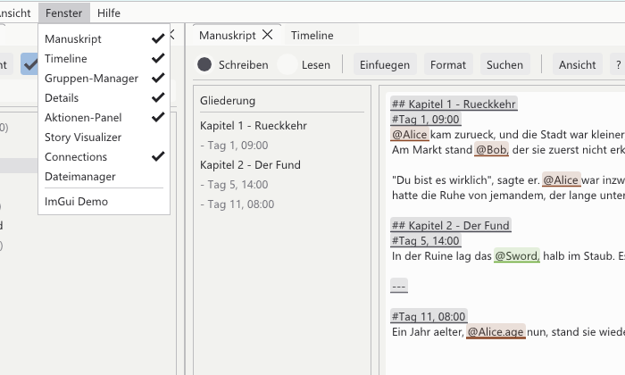

[<kbd> &nbsp; ← Overview &nbsp; </kbd>](../../README.en.md)
[<kbd> &nbsp; ← Back: 1 · Getting started &nbsp; </kbd>](01-getting-started.md)
[<kbd> &nbsp; Next: 3 · Writing → &nbsp; </kbd>](03-manuscript.md)

---

# 🪟 Chapter 2 · The program window

> **What is this about?** Which window does what, how to move them around, and how to
> bring back a window you closed by accident.

---

## 2.1 First impression


```
┌─────────────────────────────────────────────────────────────────────────────┐
│ File  Edit  View  Windows  Help               Demo Story | C:/…/Vault      │ ← menu bar
├──────────────┬──────────────────────────────────────────┬───────────────────┤
│              │  Manuscript │ Timeline                   │                   │
│  Group       │ ┌──────────────────────────────────────┐ │    Details        │
│  manager     │ │                                      │ │                   │
│              │ │   this is where you write            │ │  everything about │
│  your        │ │                                      │ │  whatever you     │
│  characters, │ │                                      │ │  clicked last     │
│  places,     │ │                                      │ │                   │
│  things      │ └──────────────────────────────────────┘ │                   │
│              ├──────────────────────────────────────────┤                   │
│              │  Actions │ Connections                   │                   │
│              │                                          │                   │
│              │   event list resp. relationship graph    │                   │
└──────────────┴──────────────────────────────────────────┴───────────────────┘
```

Five windows are open at the start. Four more can be brought in.

---

## 2.2 All windows at a glance

| Window | What for | Chapter |
|:--|:--|:--|
| ✍️ **Manuscript** | Where you write the story. The most important window. | [3](03-manuscript.md) |
| 👥 **Group manager** | The tree on the left: all characters, places and things, sorted into groups. | [4](04-groups.md) |
| 🔍 **Details** | Shows everything about the selected element, event or connection. This is where you edit fields. | [9](09-chronicle.md) |
| 📋 **Actions panel** | All events as a sortable, filterable table. | [6](06-actions.md) |
| 📅 **Timeline** | The same events as dots on a time axis, one track per element. | [7](07-timeline.md) |
| 🔗 **Connections** | The relationship net as a graph of circles and lines. | [8](08-connections.md) |
| 📜 **Story visualizer** | Reads the story back as a chronicle: "Day 1 … 14 days pass … Day 15 …". Read-only. | [9](09-chronicle.md) |
| 💾 **File manager** | Bring images and other files into the vault and link them to elements. | [10](10-files.md) |
| ⚙️ **Settings** | Language, theme, colours, your own lists. | [11](11-settings.md) |

---

## 2.3 Opening and closing a window

Every window has a **✕** in its top right corner. That does not lose it – you bring it
back any time through the **Windows** menu:



A check mark ✓ means the window is currently open. Clicking toggles it.

> 💡 Everything closed and nothing to be found? **View → Reset layout** restores the
> original arrangement.

---

## 2.4 Moving windows around (docking)

The program uses the same principle as Blender: windows stick to each other but can be
rearranged freely.

```
 Step 1: grab the title              Step 2: drag over an edge
 ┌──────────────┐                    ┌──────────────┐
 │ Timeline  ✕  │ ← drag here        │              │    ╔═══════════╗
 ├──────────────┤                    │  Manuscript  │    ║ highlight ║
 │              │                    │              │ ←  ║ shows the ║
 │              │                    │              │    ║ target    ║
 └──────────────┘                    └──────────────┘    ╚═══════════╝

 Step 3: drop
 ┌──────────────┬──────────────┐     Or: drop on the centre and both
 │  Manuscript  │   Timeline   │     become tabs of one window.
 │              │              │
 └──────────────┴──────────────┘
```

| What you want | How |
|:--|:--|
| Windows side by side | Grab the title, drag to the **edge** of another window |
| Window as a tab | Grab the title, drag onto the **centre** of another window |
| Free floating window | Grab the title, drag **onto the desktop** – it becomes its own OS window |
| Resize | Drag the divider between two windows |

Your arrangement is stored (`%APPDATA%/StoryEditor/imgui_layout_v3.ini`) and comes back
on the next start.

---

## 2.5 The menu bar

| Menu | What is in it |
|:--|:--|
| **File** | New project, open project, save, show vault in Explorer, manuscript as Word, quit |
| **Edit** | Undo / redo, new element, new group, new action |
| **View** | Theme (light/dark), language, settings, reset layout, autosave |
| **Windows** | Show and hide windows (see above) |
| **Help** | Keyboard shortcuts, about Story Editor |

The right side of the bar always shows **which project** is open and **where** it lives.

---

## 2.6 Selecting: everything is connected

Clicking anything selects it – and all the other windows follow.

```
   Click "Alice"                    Click a dot
   in the group manager             in the timeline
          │                                 │
          ▼                                 ▼
   ┌─────────────────────────────────────────────────┐
   │  Details shows Alice          Details shows     │
   │  Timeline scrolls to her      the event         │
   │  Actions filters on her       Actions scrolls   │
   └─────────────────────────────────────────────────┘
```

The same holds inside the text: clicking a coloured marker in the manuscript opens the
matching element in Details.

---

## ✅ In short

- **Manuscript** is the main window, **Details** always shows the current selection
- Closed windows come back via **Windows**, a messed-up layout via **View → Reset layout**
- Drag windows by their **title** to edges (side by side) or to the centre (as a tab)
- A selection applies **everywhere at once**

---

[<kbd> &nbsp; ← Overview &nbsp; </kbd>](../../README.en.md)
[<kbd> &nbsp; ← Back: 1 · Getting started &nbsp; </kbd>](01-getting-started.md)
[<kbd> &nbsp; Next: 3 · Writing → &nbsp; </kbd>](03-manuscript.md)
