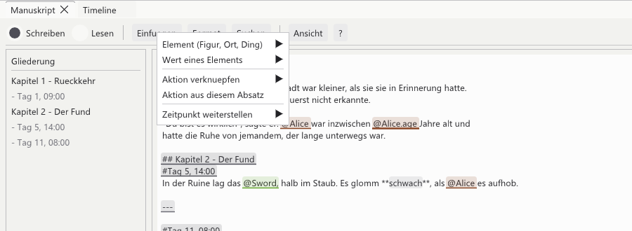
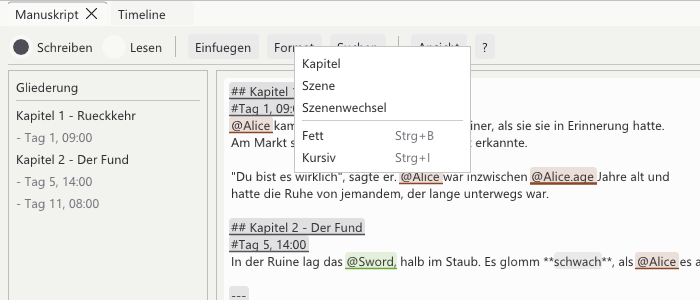
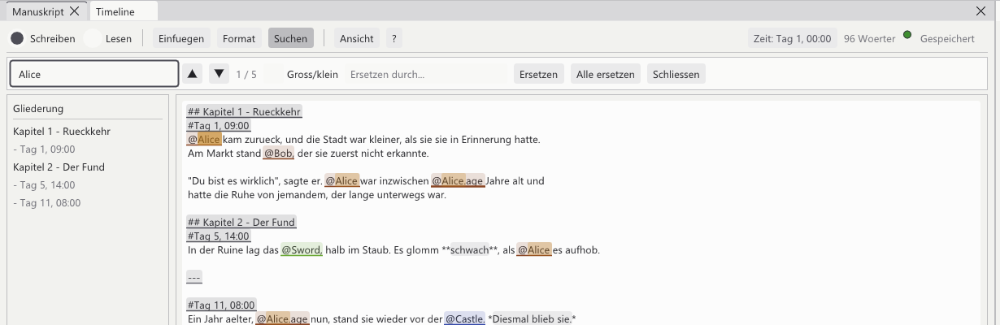
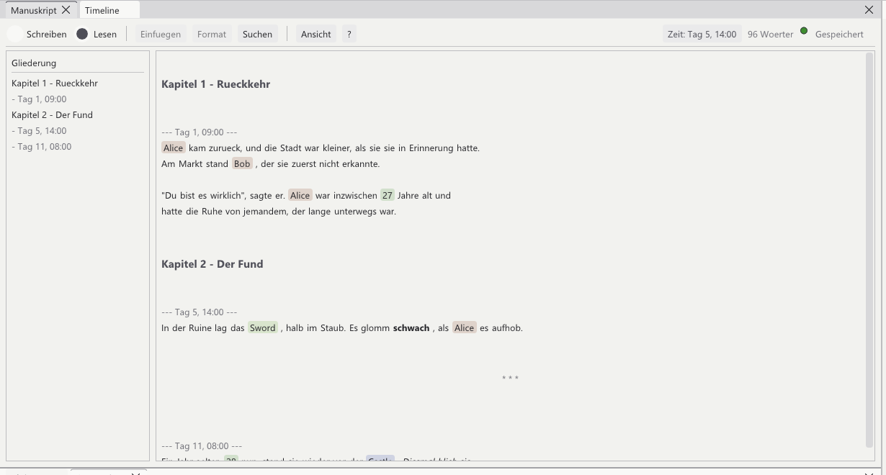
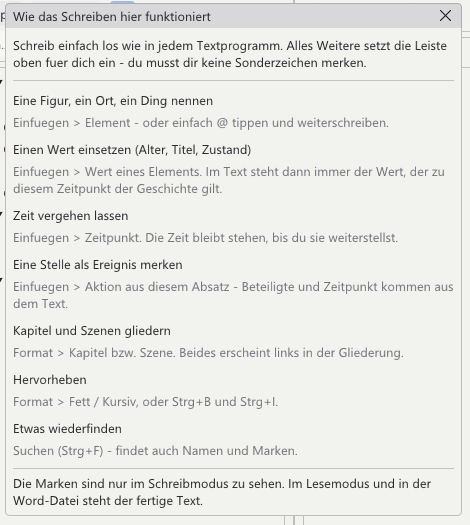

[<kbd> &nbsp; ← Overview &nbsp; </kbd>](../../README.en.md)
[<kbd> &nbsp; ← Back: 2 · The program window &nbsp; </kbd>](02-overview.md)
[<kbd> &nbsp; Next: 4 · Characters, places, things → &nbsp; </kbd>](04-groups.md)

---

# ✍️ Chapter 3 · Writing

> **The most important chapter.** This is where the actual work happens. By the end you
> can type text, insert characters, embed values, structure, emphasise and search –
> **without memorising a single special character.**

---

## 3.1 First of all: just write

The manuscript is an ordinary text field. Click into it and start typing.

```
 Day 1. Alice came back, and the town was smaller than she
 remembered it. Bob was standing at the market, and did not
 recognise her at first.
```

That works. But the program knows nothing about Alice and Bob while you do it –
to it they are just letters. The next step changes that.

---

## 3.2 The bar

Everything beyond plain text is inserted for you by the bar at the top. It is divided
into four groups:

```
┌──── what you are doing ────┬──── what goes into the text ──┬── view ───┬─ where you are ──┐
│                            │                               │           │                  │
│  ◉ Write      ○ Read       │  Insert   Format   Find       │  View  ?  │ Time: Day 5 …    │
│                            │                               │           │ 96 words         │
│                            │                               │           │ ● Saved          │
└────────────────────────────┴───────────────────────────────┴───────────┴──────────────────┘
```

| Group | What for |
|:--|:--|
| **Write / Read** | Switch between editing and the finished reading version |
| **Insert** | Put characters, values, events and points in time into the text |
| **Format** | Chapters, scenes, bold, italic |
| **Find** | Find and replace passages |
| **View** | Outline on/off, show markers, save as Word |
| **?** | A small help window summarising exactly this chapter |
| **right** | Point in time at the cursor, word count, save state |

> 💡 Everything is inserted **where your cursor was**. After the click the input jumps
> back there by itself – you can simply carry on typing.

---

## 3.3 Inserting a character

Instead of just typing "Alice", you place a **marker**. Then the program knows that
*this* Alice is meant.

### How to do it



1. Put the cursor where the name should go
2. **Insert → Element (character, place, thing)**
3. Type into the search field if the list is long
4. Click the name

The text then contains `@Alice` – with a coloured background in its group's colour.

### Faster: just type `@`

When you are in the flow, type `@` in the middle of a sentence and carry on with the
name. A suggestion list opens right under the cursor:

| Key | Effect |
|:--|:--|
| <kbd>↑</kbd> <kbd>↓</kbd> | Pick a suggestion |
| <kbd>Enter</kbd> | Accept (when something is picked) |
| <kbd>Tab</kbd> | Accept, always |
| <kbd>Esc</kbd> | Dismiss the list |

> 💡 <kbd>Enter</kbd> still starts a new paragraph as long as you have not picked
> anything. After a sentence ending like "… in front of the @Castle." you get the next
> line as usual.

### What you gain

| | |
|:--|:--|
| 🎨 **Visible** | The marker carries its group colour – characters green, places blue, things orange |
| 🔗 **Clickable** | Click opens the character in the Details window |
| 🔴 **Typo-proof** | A name that does not exist turns **red** – you see the mistake at once |
| 📊 **Usable** | The timeline now knows Alice appears in this scene |

---

## 3.4 Inserting a value

This is the trick the whole program exists for.

Instead of "Alice was 27 years old" you write **"Alice was `@Alice.age` years old"**.
The finished text then carries the number that applies *at that point in the story* –
27 in chapter 1, 28 in chapter 9.

### How to do it

1. **Insert → Value of an element**
2. Hover a character – a submenu opens with **all of its fields**
3. Next to each field is the value that applies right here
4. Click the field

```
  Insert ▸ Value of an element ▸ ● Alice ▸ ┌───────────────────────────┐
                                           │ name       Alice          │
                                           │ age        27             │
                                           │ status     Alive          │
                                           │ backstory  (empty)        │
                                           └───────────────────────────┘
```

The text then contains `@Alice.age`. If the field is empty or does not exist, the
program falls back to the name – so a gap never appears in the text.

> 📖 Why the same expression yields two different numbers is explained in
> **[Chapter 5 · How time works](05-time.md)**.

---

## 3.5 Structure and emphasis



| Menu entry | What it does | In the text |
|:--|:--|:--|
| **Chapter** | Big heading, appears in the outline on the left | `## New chapter` |
| **Scene** | Smaller heading, indented in the outline | `### New scene` |
| **Scene break** | A break inside a chapter | `---` |
| **Bold** <kbd>Ctrl</kbd>+<kbd>B</kbd> | Emphasises selected text | `**like this**` |
| **Italic** <kbd>Ctrl</kbd>+<kbd>I</kbd> | same | `*like this*` |

**Bold and italic:** select a word first, then press <kbd>Ctrl</kbd>+<kbd>B</kbd> – the
characters wrap around the selection. Without a selection both land at the cursor and
you keep typing between them.

While writing you see a faint grey background showing how far the emphasis reaches. In
reading mode and in the Word file it becomes **real bold**.

> 🛟 **Nothing can run away:** a forgotten emphasis ends at the paragraph at the latest –
> a stray asterisk never italicises the rest of the book. And a `*` in the middle of a
> sentence ("3 * 4") stays ordinary text.

---

## 3.6 The outline on the left

Every chapter, scene and point in time appears in the outline.

```
 ┌──────────────────────┐
 │ Outline              │
 ├──────────────────────┤
 │ Chapter 1 - Return   │ ← click jumps to that spot in the text
 │ - Day 1, 09:00       │
 │ Chapter 2 - The find │
 │ - Day 5, 14:00       │
 │ - Day 11, 08:00      │
 └──────────────────────┘
```

Hide it via **View → Outline**.

---

## 3.7 Find and replace



**Find** in the bar (or <kbd>Ctrl</kbd>+<kbd>F</kbd>) shows a bar above the text.

| | |
|:--|:--|
| **While typing** | *All* hits are highlighted in yellow and counted ("1 / 5") |
| <kbd>Enter</kbd> / <kbd>F3</kbd> | Jump to the next hit |
| <kbd>Shift</kbd>+<kbd>F3</kbd> | Jump to the previous one |
| ▲ ▼ | The same with the mouse |
| **Aa** | Match case |
| **Replace** | Only the hit you are on |
| **Replace all** | All of them – undoable with <kbd>Ctrl</kbd>+<kbd>Z</kbd> |

The hit you jump to is selected in the text, so you can carry on writing straight away.

---

## 3.8 Reading instead of writing



Switch to **Read** at the top. Same text, but:

| | Write | Read |
|:--|:--|:--|
| Markers | `@Alice`, `#Day 5, 14:00` visible | gone |
| Names | as a marker | inserted |
| Values | `@Alice.age` | the number, e.g. `27` |
| Bold/italic | asterisks visible | real typeface |
| Headings | `## Chapter 1` | large and coloured |
| Clicking | edits the text | clicking a marker opens the character |

For orientation you can show the time and event markers:
**View → Show markers**. They are never part of the finished Word file.

---

## 3.9 Saving

The right-hand side of the bar always shows the state:

| Display | Meaning |
|:--|:--|
| 🟢 **Saved** | Everything is in the vault |
| 🟡 **[ Save ]** | There are changes not yet written |

Normally you do nothing: after a short pause in typing (five seconds at the latest) the
program writes by itself. If you switch off **View → Autosave**, it only happens on
<kbd>Ctrl</kbd>+<kbd>S</kbd>, by clicking the yellow button, or when closing.

---

## 3.10 The built-in help



The **?** in the bar opens a short version of this chapter – handy when you are in the
middle of writing and cannot remember where something was.

---

## 📋 What actually ends up in the file

You do not have to memorise this – the bar inserts it. But in case you ever look:

| In the text | Meaning |
|:--|:--|
| `@Alice` | Reference to an element |
| `@Alice.age` | Value of that field at this point in time |
| `@Characters/Main/Alice` | Full path – in case two elements share a name |
| `#Day 5, 14:00` | From here on this point in time applies |
| `## Chapter 1` | Heading |
| `### Scene` | Sub heading |
| `**bold**` `*italic*` | Emphasis |
| `---` | Scene break |
| `!act:…` | Linked event – invisible in the finished text |

---

## ✅ In short

- Just start writing – like in any word processor
- **Insert** places characters, values, events and times; **Format** structures and emphasises
- Typing `@` is the shortcut for "insert a character"
- <kbd>Ctrl</kbd>+<kbd>F</kbd> finds passages, <kbd>Ctrl</kbd>+<kbd>B</kbd>/<kbd>I</kbd> emphasises
- **Read** shows the finished text, **?** explains it all again briefly

---

[<kbd> &nbsp; ← Overview &nbsp; </kbd>](../../README.en.md)
[<kbd> &nbsp; ← Back: 2 · The program window &nbsp; </kbd>](02-overview.md)
[<kbd> &nbsp; Next: 4 · Characters, places, things → &nbsp; </kbd>](04-groups.md)
