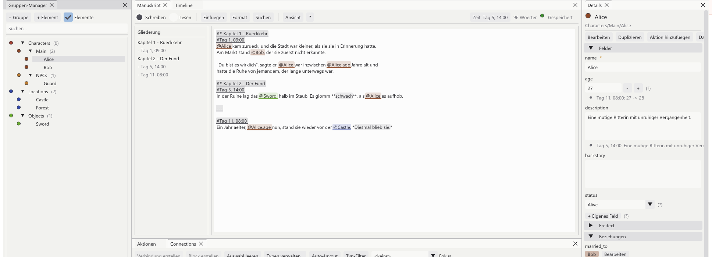

[<kbd> &nbsp; ← Overview &nbsp; </kbd>](../../README.en.md)
[<kbd> &nbsp; ← Back: 3 · Writing &nbsp; </kbd>](03-manuscript.md)
[<kbd> &nbsp; Next: 5 · How time works → &nbsp; </kbd>](05-time.md)

---

# 👥 Chapter 4 · Characters, places, things

> **What is this about?** Everything that *exists* in your story. You decide yourself
> which kinds of things there are and which properties they have.

---

## 4.1 Two terms

```
   📁 GROUP                           📄 ELEMENT
   A drawer.                          A single thing inside it.
   May contain sub groups.            Has fields with values.

   Characters ────┬── Main ────┬── Alice     name: Alice
                  │            │             age:  27
                  │            └── Bob       status: Alive
                  │
                  └── NPCs ────── Guard

   Locations ─────┬── Castle
                  └── Forest

   Objects ─────────── Sword
```

> 🔑 **Important:** the program knows no built-in notions like "person" or "place".
> `Characters`, `Locations` and `Objects` are only the suggestion made when a project is
> created. Rename them, delete them, add your own: `Factions`, `Spells`, `Ships`,
> `Recipes` – whatever your story needs.

---

## 4.2 The group manager



The tree on the left, the details of whatever is selected on the right.

| Bar at the top | Effect |
|:--|:--|
| **+ Group** | Create a group or sub group |
| **+ Element** | New element in the selected group |
| **☑ Elements** | Show or hide elements in the tree (groups only) |
| **Search…** | Filters the tree live |

**Right click** is the main route to everything else:

```
  Right click on a GROUP              Right click on an ELEMENT
  ┌────────────────────────────┐      ┌────────────────────────────┐
  │ New element…               │      │ Edit…                      │
  │ New sub group…             │      │ Rename…                    │
  │ Edit template…             │      │ Duplicate                  │
  │ Edit group (name/colour)…  │      │ Move to…                   │
  │ Delete                     │      │ Add to timeline as action  │
  └────────────────────────────┘      │ Show file in Explorer      │
                                      │ Delete                     │
                                      └────────────────────────────┘
```

Elements can also be **dragged and dropped** into another group – the `.md` file moves
along inside the vault.

---

## 4.3 Creating a group

1. Click **+ Group** (or <kbd>Ctrl</kbd>+<kbd>G</kbd>)
2. Enter a **name**, e.g. `Factions`
3. Choose a **parent group** – leave empty for a top level group
4. Optionally a **colour**; otherwise the program picks a clearly distinguishable one

The colour runs through the whole program: markers in the text, dots in the timeline,
circles in the relationship graph. Sub groups inherit a slightly shifted variant so the
kinship stays visible.

---

## 4.4 Creating an element

1. Click the group in the tree
2. **+ Element** (or <kbd>Ctrl</kbd>+<kbd>N</kbd>)
3. The dialog shows **all fields of that group's template**
4. Fill in the required fields (marked `*`), the rest is optional
5. Save → `Group/Name.md` appears in the vault

---

## 4.5 Templates: which fields does a group have?

A **template** describes which fields every element of a group has – like a form.

**Right click the group → Edit template…**

```
┌─ Template: Characters ─────────────────────────────────────┐
│                                                            │
│  Inherited fields:                  (from the parent group)│
│    (none)                                                  │
│                                                            │
│  Own fields:                                               │
│  ┌──────────────────────────────────────────────────────┐  │
│  │ name         Text      [required]    Edit    ✕       │  │
│  │ age          Integer   [required]    Edit    ✕       │  │
│  │ description  Text                    Edit    ✕       │  │
│  └──────────────────────────────────────────────────────┘  │
│                                                            │
│  [ + New field ]                                           │
│                                        [ Save ] [ Cancel ] │
└────────────────────────────────────────────────────────────┘
```

### Adding a field

**+ New field** opens a small dialog:

| Input | Meaning |
|:--|:--|
| **Field name** | What it is called, e.g. `birthday`. Also the name you use in the text as `@Alice.birthday` |
| **Type** | What kind of value (see below) |
| **Required** | Must be filled in when creating an element |
| **Default value** | What new elements start with |
| **Description** | Appears as help text next to the field |

> ⚙️ **What happens next:** the program walks through **all existing elements** of that
> group and adds the new field with its default value. Existing values are left alone.
> All affected `.md` files are rewritten.

---

## 4.6 The nine field types

| Type | What for | Input in the program | Example |
|:--|:--|:--|:--|
| 🔤 **Text** | Any text, multi-line too | Text box | `A brave knight.` |
| 🔢 **Integer** | Whole number | Number box with − / + | `27` |
| 🔣 **Float** | Decimal number | Number box | `1.78` |
| 📅 **Date** | A point in the story | Text box with validation | `Day 15, 08:00` |
| 📋 **Enum** | One of a fixed set | Dropdown (new options addable) | `Alive` / `Dead` / `Missing` |
| ☑️ **Boolean** | Yes or no | Checkbox | `true` |
| 📝 **List** | Several values | List with + / − | `["Swordfighting", "Magic"]` |
| 🔗 **Reference** | Points at another element | Search box with suggestions | `@Characters/Main/Bob` |
| 📎 **File** | Image or file | File picker, preview | `Assets/Images/alice.png` |

---

## 4.7 Inheritance: sub groups get more

A sub group inherits all fields of its parent and may add its own.

```
  📁 Characters                    name, age, description
        │                                   │
        │                                   │ inherits
        ▼                                   ▼
  📁 Main                          name, age, description
                                 + backstory
                                 + status

  → Alice (in Main) has 5 fields
  → Guard (in NPCs, no own fields) has 3
```

In the template dialog, inherited fields sit at the top, clearly separated and not
deletable – they are changed in the group that defines them.

---

## 4.8 A field for one character only

Sometimes exactly one character needs something special without everyone else getting
it too.

In the Details window at the bottom: **+ Own field**. The field then applies to this one
element only and is marked **(only here)**.

---

## 4.9 Deleting – and what happens

The program checks beforehand whether anything would break, and shows you:

```
┌─ Delete element ───────────────────────────────────┐
│                                                    │
│  Really delete "Alice"?                            │
│                                                    │
│  The following references will become invalid:     │
│   • Action #1  "Alice returns"                     │
│   • Action #5  "Alice's birthday"                  │
│   • Connection "married_to" with Bob               │
│   • 6 places in the manuscript                     │
│                                                    │
│                         [ Delete ]  [ Cancel ]     │
└────────────────────────────────────────────────────┘
```

When deleting a **group**, it also states how many elements and sub groups would go
with it.

---

## ✅ In short

- **Group** = drawer, **element** = single thing inside
- There is no built-in vocabulary – you create every group yourself
- A **template** defines a group's fields; sub groups inherit and extend
- Nine field types, from text to file
- Right click in the tree is the route to everything
- Deleting shows beforehand which references will break

---

[<kbd> &nbsp; ← Overview &nbsp; </kbd>](../../README.en.md)
[<kbd> &nbsp; ← Back: 3 · Writing &nbsp; </kbd>](03-manuscript.md)
[<kbd> &nbsp; Next: 5 · How time works → &nbsp; </kbd>](05-time.md)
