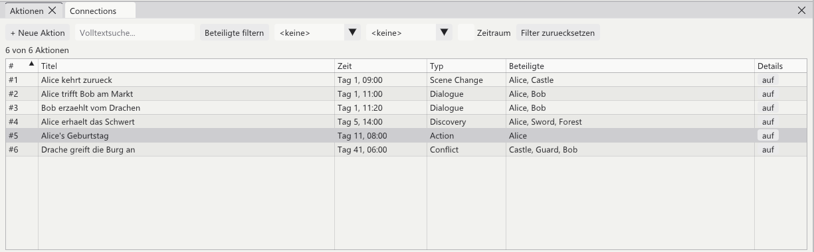

[<kbd> &nbsp; ← Overview &nbsp; </kbd>](../../README.en.md)
[<kbd> &nbsp; ← Back: 5 · How time works &nbsp; </kbd>](05-time.md)
[<kbd> &nbsp; Next: 7 · The timeline → &nbsp; </kbd>](07-timeline.md)

---

# ⚡ Chapter 6 · Events & value changes

> **What is this about?** **Actions** – single things that happen at a particular point
> in time. And how an action changes a value, so that Alice is 28 everywhere from her
> birthday on.

---

## 6.1 What is an action?

An **action** is an event in your story. It has:

```
   ┌──────────────────────────────────────────────────────┐
   │  ⚡ Alice finds the sword                             │
   ├──────────────────────────────────────────────────────┤
   │  🕐 When         Day 5, 14:00                         │
   │  📝 Description  Alice finds an ancient sword…        │
   │  👥 Involved     Alice, Sword, Forest                 │
   │  🏷️ Type         Discovery                            │
   │  🔖 Tags         magic, turning point                 │
   │  📈 Changes      Alice.power: 1 → 3                   │
   └──────────────────────────────────────────────────────┘
```

> ⚠️ **Action ≠ connection.** An action is a **moment** ("Alice gets the sword"). A
> connection is a **state** that holds for a while ("Alice owns the sword"). Connections
> are covered in [Chapter 8](08-connections.md).

---

## 6.2 The fastest way: from a paragraph

You are already writing a scene. Just turn it into an event:

1. Put the cursor anywhere inside the paragraph
2. **Insert → From paragraph** (or right click → **Action from this paragraph**)

The program fills everything in itself:

```
  Your paragraph:
  ┌──────────────────────────────────────────────────────────┐
  │ The @Sword lay in the ruin, half buried. It glowed       │
  │ **faintly** as @Alice picked it up.                      │
  └──────────────────────────────────────────────────────────┘
        │              │                    │
        │              │                    └─ involved: Alice, Sword
        │              └─ time: from the last time marker above
        └─ title: first sentence, with values inserted

  ⚡ New action "The Sword lay in the ruin, half buried"
     Day 5, 14:00 · Alice, Sword
```

At the end of the paragraph an invisible marker (`!act:…`) appears, linking text and
event. Afterwards you can tidy up the title in the Details window.

> 💡 This is how the timeline fills up **while you write** – not through forms.

---

## 6.3 The actions panel



All events as a table. This is the management view; the timeline
([Chapter 7](07-timeline.md)) shows the same data graphically.

| Column | Sortable? |
|:--|:--|
| **#** | yes – click the header |
| **Title** | yes, alphabetically |
| **Time** | yes |
| **Type** | yes |
| **Involved** | yes |
| **Details** | "open" expands the row |

### Filtering

The bar at the top narrows the list:

| Filter | Effect |
|:--|:--|
| **Full text search** | Searches title and description |
| **Filter involved** | Only events with certain elements |
| **Type** | Only Dialogue, only Conflict, … |
| **Tag** | Only one particular tag |
| **Period** | From–to |
| **Reset filters** | Show everything again |

Above the table it always says how much gets through: *"6 of 6 actions"*.

### Expanding a row

```
 ────────────────────────────────────────────────────────────────
 #4 │ Alice finds the sword               │ Day 5, 14:00
 ────────────────────────────────────────────────────────────────
   Description: Alice finds an ancient sword in a ruin.
   Involved:    Alice · Sword · Forest        ← clickable
   Tags:        magic, turning point
   Changes:     Alice.power_level: 1 → 3
   [ Edit ] [ Duplicate ] [ Show in timeline ] [ Delete ]
 ────────────────────────────────────────────────────────────────
```

---

## 6.4 Creating an action by hand

**+ New action** in the panel, <kbd>Ctrl</kbd>+<kbd>T</kbd>, double click an empty spot
in the timeline, or **Insert → Action → + New action here**.

```
┌─ New action ────────────────────────────────────────────┐
│ Title        [ Alice's birthday                       ] │
│ Description  [ Alice turns one year older.            ] │
│              [                                        ] │
│ Time         [ Day 11, 08:00       ]                    │
│              ☐ Relative to another action               │
│ Type         [ Action              ▼ ]                  │
│ Strand       [ Main plot           ▼ ]                  │
│ Tags         [ birthday                               ] │
│ ☐ Important                                             │
│                                                         │
│ Involved     ┌──────────────────────────────────────┐   │
│              │ Search…                              │   │
│              │ ☑ Alice      ☐ Bob      ☐ Guard      │   │
│              │ ☐ Castle     ☐ Forest   ☐ Sword      │   │
│              └──────────────────────────────────────┘   │
│                                                         │
│ Changes      [ + Add change ]                           │
│                                                         │
│                                   [ Save ] [ Cancel ]   │
└─────────────────────────────────────────────────────────┘
```

**Type** and **Strand** are dropdowns you can extend yourself – at the bottom of each
menu there is a field for your own entry (→ [Chapter 11](11-settings.md)).

---

## 6.5 Value changes (the heart of it)

This is where a character database turns into a story that develops.

### The problem

Alice is 27. At some point she has a birthday. After that she is 28. You do **not**
want to edit every chapter.

### The solution

Attach the change to the action:

```
┌─ Change ───────────────────────────────────────────┐
│  Element  [ Alice            ▼ ]                   │
│  Field    [ age              ▼ ]                   │
│  before   [ 27 ]    after    [ 28 ]                │
└────────────────────────────────────────────────────┘
```

From now on:

```
  Base value from the template:  age = 27
                              │
   Day 1 ──── Day 5 ──── Day 11 ──────── Day 40 ──▶
                           │
                           ⚡ "Alice's birthday"
                              age: 27 → 28
                           │
     27  27  27  27  27  │ 28  28  28  28  28
```

And that applies **everywhere at once**:

| Where | What you see |
|:--|:--|
| Manuscript before day 11 | `@Alice.age` → 27 |
| Manuscript after day 11 | `@Alice.age` → 28 |
| Details window | `age  27`, below it `• Day 11, 08:00: 27 → 28` |
| Story visualizer | `• Alice.age: 27 → 28` under the event |
| Word file | The correct number in each place, baked in |

### Creating a new field right here

In the change's field dropdown you can type a name that does not exist yet – the field
is then created on the element straight away. So you never have to detour via the
template.

---

## 6.6 Action types

For sorting and filtering. Shipped with:

| Type | What for |
|:--|:--|
| **Dialogue** | A conversation |
| **Action** | A deed |
| **Scene Change** | A change of scene |
| **Discovery** | A revelation |
| **Conflict** | A conflict |

Your own types are simply typed into the dropdown. They land in `metadata.json` and are
available everywhere from then on.

---

## 6.7 Linking text and event

If an action already exists and you want to pin it to a place in the text:

**Insert → Action** → search → click.

The text then contains `!act:…` – visible as a coloured marker while writing, invisible
in the finished text. It only says: *"this event happens here in the narration."*

---

## 6.8 Everything stays in sync

```
   Timeline                    Actions panel               Manuscript
   ────────                    ─────────────               ──────────
   drag a dot from      ───▶   time column changes  ───▶   values in the
   day 5 to day 6              immediately                 text recompute

   edit an action       ◀───   [ Edit ]

   double click an       ───▶  new row appears      ───▶   marker placed
   empty spot                  immediately
```

There is no "refresh" button – all windows always show the same state.

---

## ✅ In short

- An **action** = an event at a point in time, with participants
- Fastest route: **Insert → From paragraph** or right click → **Action from this paragraph**
- **Changes** on an action shift values from that point on – everywhere
- Types, strands and tags can be extended freely
- Actions panel and timeline show the same data, differently

---

[<kbd> &nbsp; ← Overview &nbsp; </kbd>](../../README.en.md)
[<kbd> &nbsp; ← Back: 5 · How time works &nbsp; </kbd>](05-time.md)
[<kbd> &nbsp; Next: 7 · The timeline → &nbsp; </kbd>](07-timeline.md)
