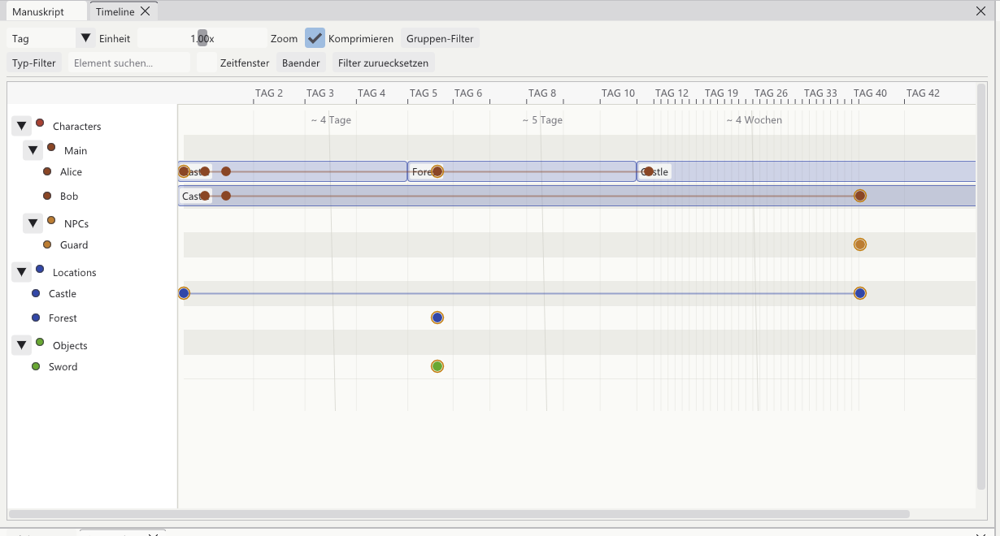

[<kbd> &nbsp; ← Overview &nbsp; </kbd>](../../README.en.md)
[<kbd> &nbsp; ← Back: 6 · Events &nbsp; </kbd>](06-actions.md)
[<kbd> &nbsp; Next: 8 · Relationships → &nbsp; </kbd>](08-connections.md)

---

# 📅 Chapter 7 · The timeline

> **What is this about?** The map of your story. One row per character, place and
> thing – and every event on it as a dot.

---

## 7.1 What it looks like



```
                  ◀────────────── time runs to the right ───────────────▶
                  DAY 2   DAY 3   DAY 5     DAY 8      DAY 19    DAY 40
  ┌─────────────┬──────────────────────────────────────────────────────┐
  │             │        ~ 4 days        ~ 5 days       ~ 4 weeks      │ ← compressed
  │ ▼ Characters│                                                      │   empty gaps
  │  ▼ Main     │                                                      │
  │    ● Alice  │ ▓Cstl▓●━━●━━━━━▓Frst▓●━━━━━━━━━━━▓Cstl▓              │
  │    ● Bob    │ ▓Cstl▓●━━●━━━━━━━━━━━━━━━━━━━━━━━━━━━━━━━━━━━━━━●    │
  │  ▼ NPCs     │                                                      │
  │    ● Guard  │                                              ●       │
  │ ▼ Locations │                                                      │
  │    ● Castle │ ●━━━━━━━━━━━━━━━━━━━━━━━━━━━━━━━━━━━━━━━━━━━━━━━●    │
  │    ● Forest │                 ●                                    │
  │ ▼ Objects   │                                                      │
  │    ● Sword  │                 ●                                    │
  └─────────────┴──────────────────────────────────────────────────────┘
       tracks                     events as dots
```

| Element | Meaning |
|:--|:--|
| **Track** (row) | An element or a group. ▼/▶ folds it |
| **Dot** ● | An event this element takes part in. Colour = group colour |
| **Band** ▓…▓ | A connection that holds over this period (→ [Chapter 8](08-connections.md)) |
| **~ 4 weeks** | A stretch without events, squeezed together |

---

## 7.2 The non-linear time axis

A problem every timeline has: in your story a lot happens on one day and then nothing
for a year. Drawn to scale that would be useless.

```
  Truly to scale:
  ●●●●●────────────────────────────────────────────────────────────●
  all on      a year in which nothing happens – but 95 % of the width
  one day

  How the program draws it:
  ●───●───●───●───●   ~ 1 year   ●
  dense stretches get stretched, empty ones squeezed
```

Controlled from the filter bar:

| Control | Effect |
|:--|:--|
| **Unit** | Minute · hour · day · week · month · year – how fine the labels are |
| **Zoom** | Slider; or <kbd>Ctrl</kbd> + mouse wheel over the timeline |
| **☑ Compress** | Squeeze empty stretches. Off = true scale |

<kbd>Shift</kbd> + mouse wheel scrolls horizontally.

---

## 7.3 Working with events

| Action | Effect |
|:--|:--|
| 🖱️ **Hover** | Tooltip with title, start of the description, time and participants |
| 🖱️ **Click** | Select – Details window and actions panel follow |
| 🖱️ **Drag** | Change the point in time. A translucent ghost shows where it will land |
| 🖱️ **Double click empty spot** | New event at that time, with that element as a participant |
| 🖱️ **Right click** | Menu: edit, duplicate, delete, set a connection |

On dropping after a drag, the change is written to the vault immediately – and the
actions panel shows the new time in the same instant.

---

## 7.4 Tracks

```
 ▼ Characters          ← clicking ▼ folds the whole group
   ▼ Main
     ● Alice           ← one track per element
     ● Bob
   ▶ NPCs              ← folded: Guard is hidden
```

| | |
|:--|:--|
| **Fold / unfold** | ▼ / ▶ left of the name |
| **Column width** | Drag the vertical divider between names and the time area |
| **Row height** | Settings → *Timeline row height* |
| **Colour** | The dot before the name shows the group colour |

---

## 7.5 Filters

Two rows above the time area:

| Filter | Effect |
|:--|:--|
| **Group filter** | Show only certain groups (multi-select) |
| **Type filter** | Only certain event types |
| **Find element…** | Live search over all track names |
| **Time window** | Narrow down from–to |
| **Bands** | Which connection types are drawn as bands |
| **Reset filters** | Show everything again |

Active filters are highlighted so you never wonder why something is missing.

---

## 7.6 Timeline or actions panel?

Both show the same data. Take whichever fits the question:

| | 📅 Timeline | 📋 Actions panel |
|:--|:--|:--|
| **Shape** | Dots on an axis | Table |
| **Good for** | *When* something happens, what runs in parallel, where the gaps are | Searching, sorting, reading details, editing many fields |
| **Editing** | Dragging | Form |
| **Sorting** | always chronological | freely selectable |

Both windows can be opened and closed independently – and are always in sync.

---

## ✅ In short

- One **track** per element, one **dot** per event, one **band** per connection
- Empty stretches get squeezed, dense ones stretched – switchable via **Compress**
- **Dragging** moves an event in time, **double click** creates a new one
- <kbd>Ctrl</kbd>+wheel zooms, <kbd>Shift</kbd>+wheel scrolls

---

[<kbd> &nbsp; ← Overview &nbsp; </kbd>](../../README.en.md)
[<kbd> &nbsp; ← Back: 6 · Events &nbsp; </kbd>](06-actions.md)
[<kbd> &nbsp; Next: 8 · Relationships → &nbsp; </kbd>](08-connections.md)
