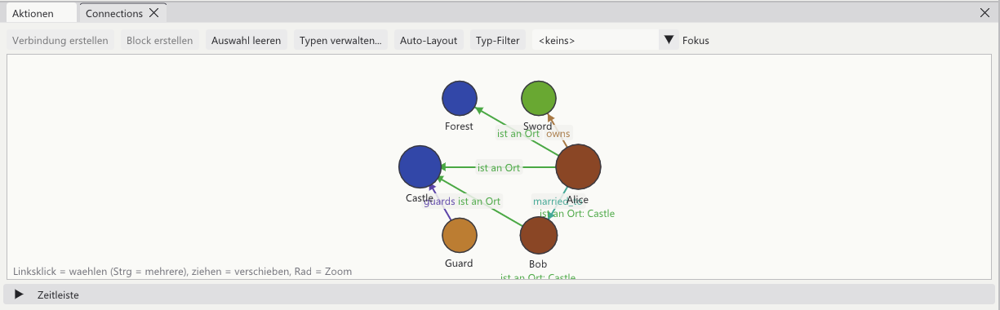

[<kbd> &nbsp; ← Overview &nbsp; </kbd>](../../README.en.md)
[<kbd> &nbsp; ← Back: 7 · The timeline &nbsp; </kbd>](07-timeline.md)
[<kbd> &nbsp; Next: 9 · Chronicle & detail panel → &nbsp; </kbd>](09-chronicle.md)

---

# 🔗 Chapter 8 · Relationships

> **What is this about?** Everything that **holds** for a while: being married, being
> in a place, owning something, hating someone. And about the fact that you invent the
> kinds of relationship yourself.

---

## 8.1 Action or connection?

```
   ⚡ ACTION                          🔗 CONNECTION
   A moment.                         A state.

   "Alice and Bob marry"             "Alice is married to Bob"
   Day 12, 11:00                     from day 12, no end

   "Alice enters the castle"         "Alice is at place: Castle"
   Day 1, 09:00                      day 1 until day 4

   ──●──────────────────▶            ──▓▓▓▓▓▓▓▓▓▓▓▓▓▓──────▶
     a point                           a period
```

Often you want both: the event *and* the state it causes.

---

## 8.2 The graph



| | |
|:--|:--|
| ⭕ **Circle** (node) | An element. Colour = group colour |
| ➖ **Line** (edge) | A connection, labelled with its type |
| ➡️ **Arrow** | Points from the first to the second role |
| **Text under the circle** | What holds for this element **right now**, e.g. `at place: Castle` |

| Mouse | Effect |
|:--|:--|
| **Drag** | Move a node (the position is stored) |
| **Click** | Select → Details window |
| <kbd>Ctrl</kbd>+**click** | Select several |
| **Wheel** | Zoom |
| **Right click a line** | Edit / delete |

The bar at the top:

| Button | Effect |
|:--|:--|
| **Create connection** | From the currently selected nodes |
| **Create block** | Group several connections together |
| **Clear selection** | |
| **Manage types…** | Define your own kinds of relationship (see below) |
| **Auto layout** | Spread the nodes out automatically |
| **Type filter** | Show only certain kinds |
| **Focus** | Show only one element and its neighbours |

---

## 8.3 Your own relationship types, with roles

This is the part that sets the program apart from a rigid character manager.

**Manage types… → New type**

```
┌─ Connection type ─────────────────────────────────────────┐
│                                                           │
│  Name:      [ Person at place                           ] │
│                                                           │
│  Role 1:    [ Person ]  →  group [ Characters       ▼ ]   │
│  Role 2:    [ Place  ]  →  group [ Locations        ▼ ]   │
│             [ + add role ]                                │
│                                                           │
│  ☑ Settable from the timeline (temporal)                  │
│     ☑ only one at a time per element                      │
│     ☑ draw a band in the timeline                         │
│       band runs in the track of: [ Person ▼ ]             │
│       labelled with:             [ Place  ▼ ]             │
│                                                           │
│                                     [ Save ] [ Cancel ]   │
└───────────────────────────────────────────────────────────┘
```

| Setting | What it does |
|:--|:--|
| **Role + group** | When setting the connection only elements of that group are offered. "All groups" works too |
| **Any number of roles** | A connection may have three or more participants |
| **Temporal** | The connection gets a "from" and optionally an "until" |
| **Exclusive** | As soon as a new one starts, the previous one ends automatically |
| **Draw a band** | Appears as a coloured bar in the timeline |

### Why "exclusive" is so useful

A character can only be in one place at a time. With *exclusive* you never have to
enter an end date:

```
  You enter:      Alice at place: Castle     from day 1
  You enter:      Alice at place: Forest     from day 5
                              │
                              ▼  the program does this by itself
  Alice at place: Castle      day 1 until day 5
  Alice at place: Forest      from day 5
```

And the best part: the program never knows the word "place". You built the concept
yourself.

---

## 8.4 Setting a connection

**Route 1 – in the graph**

1. Click the first node, <kbd>Ctrl</kbd>+click the second
2. **Create connection**
3. Pick a type, assign the roles, optionally enter from/until

**Route 2 – in the timeline**

Right click in a track → **Set connection**. The point in time comes from where you
clicked.

**Route 3 – in the Details window**

Every element has a **Relationships** section with **+ Connection**.

---

## 8.5 Where connections show up

| Place | How they appear |
|:--|:--|
| 📅 **Timeline** | Coloured band behind the track: `▓ Castle ▓│▓ Forest ▓│▓ Castle →` |
| 🔗 **Graph** | Labelled line; under each circle the current state |
| 🔍 **Details** | Roles, period, participants – editable |
| 📄 **Element file** | Section `## Beziehungen` with `married_to -> [[Bob]]` |

### The time slider

Below the graph sits **Timeline** (collapsible). With it you move through the story and
see which relationships hold on a chosen day.

---

## 8.6 Blocks

A **block** groups several connections belonging to one theme:

```
  ┌─ Block: love triangle ──────────────────┐
  │                                         │
  │    Alice ──── married ──── Bob          │
  │      ▲                       ▲          │
  │      │ loves                 │ loves    │
  │      └────────── Carol ──────┘          │
  │                                         │
  └─────────────────────────────────────────┘
```

Select nodes → **Create block** → give it a name. In the graph a block can be collapsed
to keep the net readable.

---

## 8.7 Older projects

Projects from an earlier version of the program load without any work: the old `type`
text field becomes a type with two roles, `source`/`target` become those roles, and
date fields are parsed.

---

## ✅ In short

- **Action** = moment, **connection** = state over a period
- You invent the kinds of relationship yourself – with any number of **roles**
- **Temporal** gives them from/until, **exclusive** ends the previous one automatically
- Visible in the graph, as a **band** in the timeline, and in Details
- **Blocks** group related connections together

---

[<kbd> &nbsp; ← Overview &nbsp; </kbd>](../../README.en.md)
[<kbd> &nbsp; ← Back: 7 · The timeline &nbsp; </kbd>](07-timeline.md)
[<kbd> &nbsp; Next: 9 · Chronicle & detail panel → &nbsp; </kbd>](09-chronicle.md)
